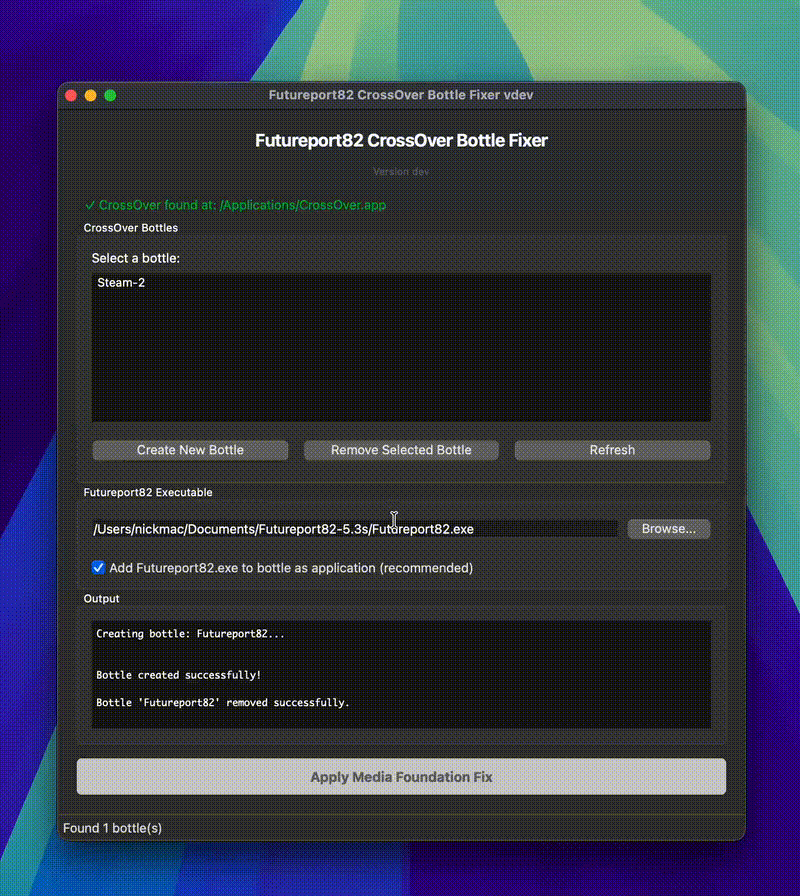
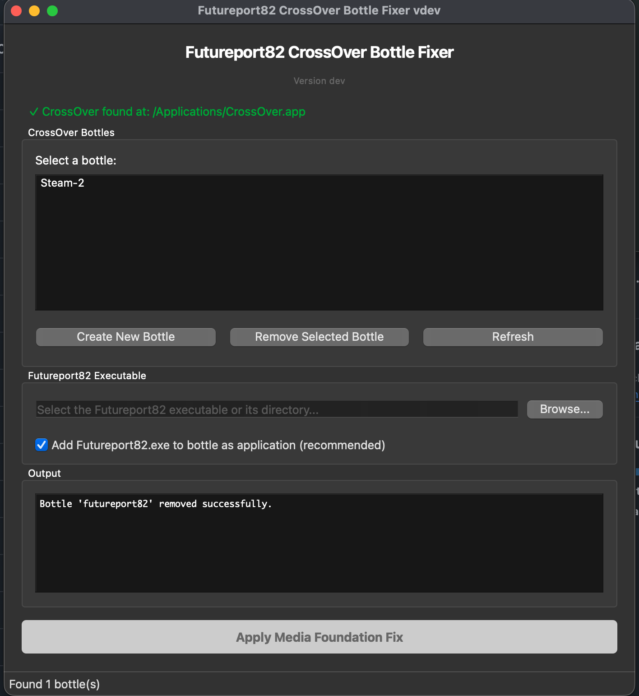
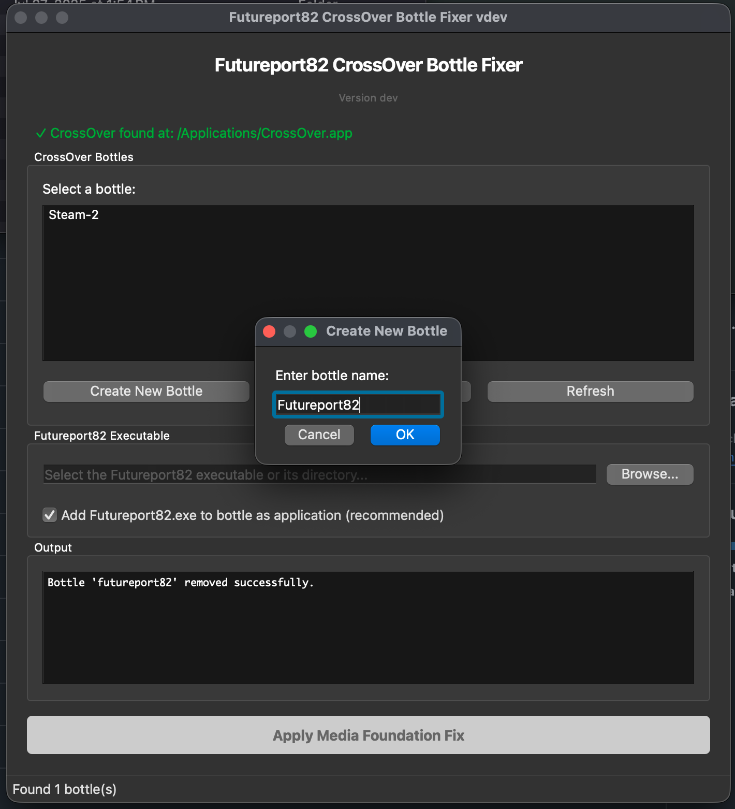
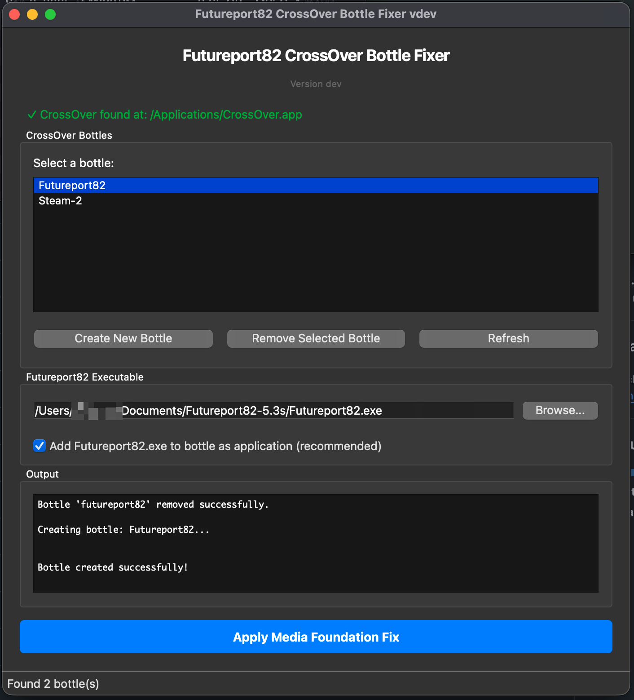

# Futureport82 Whitescreen Video Fixer for Mac's running Crossover

A macOS application that fixes CrossOver bottles to work with Futureport82's media foundation requirements. This fixes the "White Screen" issue a Mac user will see when viewing any video screen in Futureport82.  


The fixes for this work are inspired by [HoodedDeath's MF Fix](https://github.com/HoodedDeath/mf-fix)

## Features

- **Native macOS GUI**: Built with PyQt6 for a native Apple Silicon macOS experience
- **Bottle Management**: List, create, and remove CrossOver bottles
- **Easy Executable Selection**: Browse and select your Futureport82 executable
- **One-Click Fix**: Apply all media foundation fixes with a single button click
- **Real-time Output**: See progress and output from the fix script
- **Command-Line Interface**: Also available as a CLI tool for automation

## Quick Start Guide

### Download and Install

1. Download the [latest release](https://github.com/nickmaccarthy/Futureport82-Video-Whitescreen-Fix-Mac-Crossover/releases/latest)
2. Open the downloaded DMG file
3. Drag `Futureport82Fixer.app` to your Applications folder (or run it directly from the DMG)

### Step 1: Watch the Setup Process

Here's a quick animated guide showing the complete setup process:



**Step 2: Launch the Application**

Launch `Futureport82Fixer.app` or run `python3 find-bottles-gui.py` to open the main window.



**Step 3: Select or Create a Bottle**

Choose an existing CrossOver bottle from the list, or click "Create New Bottle" to create a new one.



**Step 4: Select Futureport82 Executable**

Click "Browse..." and navigate to your Futureport82 executable file (or its directory).



**Step 5: Apply the Fix**

Click "Apply Media Foundation Fix" and enter your administrator password when prompted. The fix will run automatically and show progress in the output window.

**⚠️ Important**: During the fix process, CrossOver may show 'OK' dialogs in the dock. Click the CrossOver icon to see and dismiss them.

**Step 6: Done!**

Once the fix completes successfully, your Futureport82 installation should work properly with video playback. You can now launch Futureport82 from CrossOver.

## Requirements

- macOS (Apple Silicon - arm64)
- Python 3.8 or later
- CrossOver installed at `/Applications/CrossOver.app`
- PyQt6 (will be installed automatically)

## Installation

### Option 1: Download Pre-built App

Download the latest release from the [Releases](https://github.com/YOUR_USERNAME/fp82-mac-fix/releases) page.

**⚠️ Important**: After downloading, **move the app to your Applications folder** before running it. This prevents macOS from running it in a read-only location (App Translocation) which can cause issues.

1. Open Finder and go to your Downloads folder
2. Drag `Futureport82Fixer.app` to your Applications folder
3. Open it from Applications

**⚠️ Security Warning**: macOS may show a warning that the app "cannot be verified" when you first open it. This is normal for unsigned apps. To open it:

1. Right-click (or Control-click) on `Futureport82Fixer.app`
2. Select "Open" from the context menu
3. Click "Open" in the security dialog

Alternatively, go to **System Settings > Privacy & Security** and click "Open Anyway" next to the blocked app message.

### Option 2: Build from Source

1. Clone this repository:
```bash
git clone https://github.com/YOUR_USERNAME/fp82-mac-fix.git
cd fp82-mac-fix
```

2. Install dependencies:
```bash
pip3 install -r requirements.txt
pip3 install pyinstaller
```

3. Build the app:
```bash
chmod +x build-app.sh
./build-app.sh
```

This will create `Futureport82Fixer.app` in the current directory.

## Usage

### GUI Version

1. **Launch the app**: 
   - Double-click `Futureport82Fixer.app`, or
   - Run `make gui`, or
   - Run `python3 find-bottles-gui.py`

2. **Select or create a bottle**: 
   - Choose an existing bottle from the list, or
   - Click "Create New Bottle" to create a new one

3. **Select Futureport82 executable**: 
   - Click "Browse..." and select your Futureport82 executable (or its directory)

4. **Apply fix**: 
   - Click "Apply Media Foundation Fix" and enter your administrator password when prompted
   - ⚠️ **Important**: Watch for CrossOver dialogs in the dock during the fix process

### Command-Line Version

Run the CLI tool:
```bash
make go-fast
# or
python3 find-bottles.py
```

Follow the interactive prompts to select a bottle and provide the Futureport82 executable path.

## Building a Distributable App

To create a standalone macOS app bundle:

```bash
./build-app.sh
```

This will create `Futureport82Fixer.app` in the current directory.

### Creating a DMG (Optional)

To create a DMG file for distribution:

```bash
hdiutil create -volname "Futureport82Fixer" -srcfolder "Futureport82Fixer.app" -ov -format UDZO "Futureport82Fixer.dmg"
```

## How It Works

The application applies Windows Media Foundation fixes to CrossOver bottles by:

1. Copying required Media Foundation DLLs to the bottle's system directories
2. Registering Media Foundation components in the Windows registry
3. Configuring the bottle environment for proper media playback

All fixes are applied automatically with a single click.

## Troubleshooting

- **"App cannot be verified" warning**: See the [Security Warning](#option-1-download-pre-built-app) section above for instructions on how to open the app
- **CrossOver not found**: Ensure CrossOver is installed at `/Applications/CrossOver.app`
- **Permission errors**: The fix script requires administrator privileges to modify system DLLs
- **Script not found**: Ensure `mf-fix-cx.sh` is in the same directory as the application
- **CrossOver dialogs**: During the fix, CrossOver may show 'OK' dialogs in the dock. Click the CrossOver icon to see and dismiss them

## Technology Stack

- **PyQt6**: Modern, native-looking GUI framework for macOS
- **Python 3**: Core language
- **PyInstaller**: For creating distributable app bundles
- **Bash**: For system-level fixes and automation

## Contributing

Contributions are welcome! Please feel free to submit a Pull Request.

## License

[Add your license here]

## Acknowledgments

This tool helps make Futureport82 playable on macOS through CrossOver by fixing Media Foundation compatibility issues.

